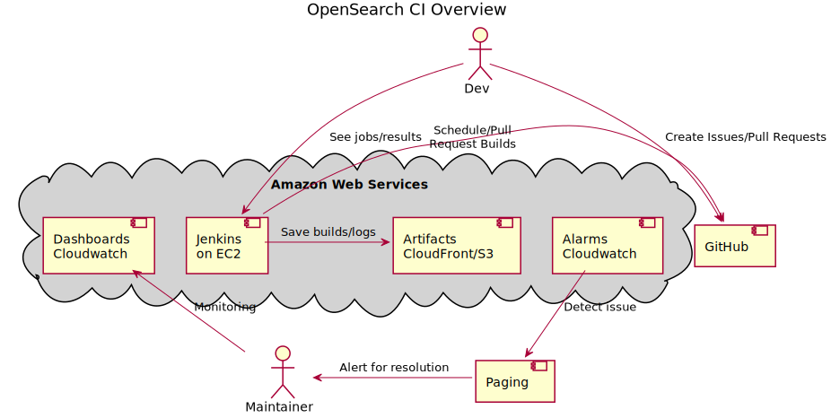

- [OpenSearch Continuous Integration](#opensearch-continuous-integration)
- [Getting Started](#getting-started)
- [Deployment](#deployment)
  - [CI Deployment](#ci-deployment)
  - [Dev Deployment](#dev-deployment)
  - [Executing Optional Tasks](#executing-optional-tasks)
    - [SSL Configuration](#ssl-configuration)
    - [Setup OpenId Connect (OIDC) via Federate](#setup-openid-connect-oidc-via-federate)
    - [Restricting Server Access](#restricting-server-access)
    - [Data Retention](#data-retention)
    - [Add environment variable](#add-environment-variables)
    - [Assume role](#cross-account-assume-role)
    - [Mac agents](#mac-agents)
    - [Use Production Agents](#use-production-agents)
  - [Troubleshooting](#troubleshooting)
    - [Main Node](#main-node)
  - [Useful commands](#useful-commands)
  - [Architecture Overview](#architecture-overview)
- [Contributing](#contributing)
- [Getting Help](#getting-help)
- [Code of Conduct](#code-of-conduct)
- [Security](#security)
- [License](#license)
- [Copyright](#copyright)

## OpenSearch Continuous Integration

OpenSearch Continuous Integration is an open source CI system for OpenSearch and its plugins.

## Getting Started

- Requires [NPM](https://docs.npmjs.com/cli/v7/configuring-npm/install) to be installed
- Install project dependencies using `npm install` from this project directory
- Configure [aws credentials](https://docs.aws.amazon.com/cdk/latest/guide/getting_started.html#getting_started_prerequisites)
- Deploy stacks with `npm run cdk deploy`

## Deployment

**_Important: Please ensure to use strong passwords for you jenkins instance in order to keep it secure._**

### CI Deployment
1. Create another cdk project and depend on this package
2. Import the config / ci stacks alongside the other resources
   ```typescript
   new CIConfigStack(app, 'CI-Config-Beta', {});
   new CIStack(app, 'CI-Beta', ciSettings, {});
   ```
3. Update the `ciSettings` according to the environment needs such as SSL or strict deployment, see [CIStackProps](./lib/ci-stack.ts) for details.
4. Update the `assetsSettings` according to the environment needs such as SSL or strict deployment, see [deployAwsAssetProps](./lib/ci-stack.ts) for details.
5. Deploy using the CI system of your choice.

### Dev Deployment 
1. Setup your local machine to credentials to deploy to the AWS Account
2. Deploy the bootstrap stack by running the following command that sets up required resources to create the stacks. [More info](https://docs.aws.amazon.com/cdk/latest/guide/bootstrapping.html)
   
   `npm run cdk bootstrap -- -c useSsl=false -c runWithOidc=false -c serverAccessType=ipv4 -c restrictServerAccessTo=10.10.10.10/32`
   
3. Deploy the ci-config-stack using the following (takes ~1 minute to deploy) - 
   
   `npm run cdk deploy OpenSearch-CI-Config-Dev -- -c useSsl=false -c runWithOidc=false -c serverAccessType=ipv4 -c restrictServerAccessTo=10.10.10.10/32`
   
4. Locate the secret manager arns in the ci-config-stack outputs for `CASC_RELOAD_TOKEN` and update the secret value ([see docs](https://docs.aws.amazon.com/cli/latest/reference/secretsmanager/put-secret-value.html)) with the password you want to use to reload jenkins configuration. _Do not enclose it in quotes_
```
$aws secretsmanager put-secret-value \
--secret-id MyCASCreloadTokenSecretARN \
--secret-string CascReloadToken
```

5. [Optional](#ssl-configuration) Configure the elements of the config stack for SSL configuration
6. [Optional](#setup-openid-connect-oidc-via-federate) Configure the elements setting up oidc via federate
7. Deploy the ci-stack, takes ~10 minutes to deploy (parameter values depend on step 2 and step 3)
   
   `npm run cdk deploy OpenSearch-CI-Dev -- -c useSsl=false -c runWithOidc=false -c serverAccessType=ipv4 -c restrictServerAccessTo=10.10.10.10/32`
8. Fetch the key-pair id of `AgentNodeKeyPair` and locate actual value in SSM Parameter Store, it will of the format `/ec2/keypair/{key_pair_id}`. Add the actual value in Secrets Manager to secret named `jenkins-agent-node-key-pair`. This will allow jenkins manager node to be able to connect to agent nodes. 

9. When OIDC is disabled, this set up will enforce the user to secure jenkins by adding first admin user on deployment. Create admin user and password, fill in all other details like name and email id to start using jenkins.
10. Go to the `OpenSearch-CI-Dev.JenkinsExternalLoadBalancerDns` url returned by CDK output to access the jenkins host.
11. If you want to destroy the stack make sure you delete the agent nodes manually (via jenkins UI or AWS console) so that shared resources (like vpc, security groups, etc) can be deleted.

### Executing Optional Tasks
#### Construct Props
| Name                                                             | Type     | Description                                                                              |
|------------------------------------------------------------------|:---------|:-----------------------------------------------------------------------------------------|
| [useSsl](#ssl-configuration) <required>                          | boolean  | Should the Jenkins use https                                                             |
| [runWithOidc](#setup-openid-connect-oidc-via-federate)<required> | boolean  | Should an OIDC provider be installed on Jenkins                                          |
| [restrictServerAccessTo](#restricting-server-access) <required>  | Ipeer    | Restrict jenkins server access                                                           |
| [ignoreResourcesFailures](#ignore-resources-failure)             | boolean  | Additional verification during deployment and resource startup                           |
| [adminUsers](#setup-openid-connect-oidc-via-federate)            | string[] | List of users with admin access during initial deployment                                |
| [additionalCommands](#runnning-additional-commands)              | string   | Additional logic that needs to be run on Master Node. The value has to be path to a file |
| [dataRetention](#data-retention)                                 | boolean  | Do you want to retain jenkins jobs and build history                                     |
| [agentAssumeRole](#assume-role)                                  | string   | IAM role ARN to be assumed by jenkins agent nodes                                        |
| [envVarsFilePath](#add-environment-variables)                    | string   | Path to file containing env variables in the form of key value pairs                     |
| [macAgent](#mac-agents)                                          | boolean  | Add mac agents to jenkins                                                                |
| [useProdAgents](#use-production-agents)                          | boolean  | Should jenkins server use production agents                                              |
| [enableViews](#enable-views)                                     | boolean  | Adds Build, Test, Release and Misc views to Jenkins Dashboard . Defaults to false        |
#### SSL Configuration
1. Locate the secret manager arns in the ci-config-stack outputs
1. Update the secret value ([see docs](https://docs.aws.amazon.com/cli/latest/reference/secretsmanager/put-secret-value.html)) for the `certContentsSecret` with the certificate contents
```
$aws secretsmanager put-secret-value \
--secret-id MyTestDatabaseSecret_or_ARN \
--secret-string file://mycreds.json_or_value
```
1. Update the secret value ([see docs](https://docs.aws.amazon.com/cli/latest/reference/secretsmanager/put-secret-value.html)) for the `privateKeySecret` with the certificate private key
1. Upload the certificate to IAM [see docs](https://docs.aws.amazon.com/cli/latest/reference/iam/upload-server-certificate.html)
1. Update the secret value for the `certificateArnSecret` with the certificate arn generated by IAM
1. Update the secret value for `redirectUrlSecret` with a dummy or valid redirect URL. eg: https://dummyJenkinsUrl.com
1. Run with parameter using one of the following (refer [this](#setup-openid-connect-oidc-via-federate)  for value of `runWithOidc`)
   1. `npm run cdk deploy OpenSearch-CI-Dev -- -c useSsl=true -c runWithOidc=true` or,
   1. `cdk deploy OpenSearch-CI-Dev -c useSsl=true -c runWithOidc=true`
1. Continue with [next steps](#dev-deployment)

#### Setup OpenId Connect (OIDC) via Federate
1. Locate the secret manager arns in the ci-config-stack outputs
1. Update the secret value ([see docs](https://docs.aws.amazon.com/cli/latest/reference/secretsmanager/put-secret-value.html)) for the `OIDCClientIdSecret` with the credentials as json as follows:
   1. JSON format
   ```
    {
        "clientId": "example_id",
        "clientSecret": "example_password",
        "wellKnownOpenIDConfigurationUrl": "https://www.example.com",
        "tokenServerUrl": "https://example.com/token",
        "authorizationServerUrl": "https://example.com/authorize",
        "userInfoServerUrl": "https://example.com/userinfo"
    }
    ```
   1. Command Eg: [see docs](https://docs.aws.amazon.com/cli/latest/reference/secretsmanager/put-secret-value.html)
   ```
    $aws secretsmanager put-secret-value \
    --secret-id MyTestDatabaseSecret_or_ARN \
    --secret-string file://mycreds.json_or_value
    ```
1. Add additional `adminUsers` for role based authentication according to your needs, see [CIStackProps](./lib/ci-stack.ts) for details.
1. Run with parameter with one of the following (refer [this](#ssl-configuration) for value of `useSsL`) -
   1. `npm run cdk deploy OpenSearch-CI-Dev -- -c runWithOidc=true -c useSsl=true` or,
   1. `cdk deploy OpenSearch-CI-Dev -c runWithOidc=true -c useSsl=true`
1. Continue with [next steps](#dev-deployment)

#### Restricting Server Access
You need to restrict access to your jenkins endpoint (load balancer). Here's how:

1. Using command line as below:

```
npm run cdk synth OpenSearch-CI-Dev -- -c useSsl=false -c runWithOidc=false -c serverAccessType=ipv4 -c restrictServerAccessTo=10.10.10.10/32
```
Below values are allowed:
| serverAccessType| restrictServerAccessTo| 
|-----------------|:---------|
| ipv4            | all (0.0.0.0/0) or any ipv4 CIDR (eg: 10.10.10.10/32)  |
| ipv6            | all (::/0) or any ipv6 CIDR (eg: 2001:0db8:85a3:0000:0000:8a2e:0370:7334)  |
| prefixList      | Prefix List id (eg: ab-12345)  |
| securityGroupId | A security group ID (eg: sg-123456789)  |


2. You can also update the `restrictServerAccessTo` property in `ciSettings` to your desired [Ipeer](https://docs.aws.amazon.com/cdk/api/v1/docs/@aws-cdk_aws-ec2.IPeer.html).
See [CIStackProps](./lib/ci-stack.ts) for details.

Example:
```
const stack = new CIStack(app, 'MyStack', { restrictServerAccessTo: Peer.ipv4('10.0.0.0/24') });
```


#### Ignore resources failure
Update the `ignoreResourcesFailures` property in `ciSettings`.
This parameter is used to ignore resources failure if the option is available. Right now that is only applicable while for EC2 [init scripts](https://github.com/opensearch-project/opensearch-ci/blob/main/lib/compute/jenkins-main-node.ts#L116).

#### Data Retention
Change in any EC2 config (specially init config) leads to replacement of EC2. The jenkins configuration is managed via code using configuration as code plugin. [More details](https://plugins.jenkins.io/configuration-as-code/).
See inital [jenkins.yaml](./resources/baseJenkins.yaml)
If you want to retain all the jobs and its build history, 
1. Update the `dataRetention` property in `ciSettings` to true (defaults to false) see [CIStackProps](./lib/ci-stack.ts) for details.
This will create an EFS (Elastic File System) and mount it on `/var/lib/jenkins` which will retain all jobs and its build history.

#### Add environment variables
Users can add global level environment variables using configuration as code as follows:

Update the `envVarsFilePath` property in `ciSettings` to the *yaml* file path containing all environment variables in the form of key:value pair. See [CIStackProps](./lib/ci-stack.ts) for details.

Example: See [env.txt](./test/data/env.yaml)
```
envVarsFilePath = 'test/data/env.yaml'
```

#### Assume role
The Created jenkins agent role can assume cross account role by passing `agentAssumeRole` parameter
Example:
```
npm run cdk deploy OpenSearch-CI-Dev -- -c useSsl=false -c runWithOidc=false -c agentAssumeRole=arn:aws:iam::522XXX13897:role/sample-assume-role
```
NOTE: The assume role has to be pre-created for the agents to assume. Once CDK stack is deployed with `-c agentAssumeRole` flag, make sure this flag is passed for next CDK operations to make sure this created policy that assumes cross-account role is not removed.

#### Mac agents
##### Prerequisite
To deploy mac agents, as a prerequisites make sure the backend AWS account has dedicated hosts setup done with instance family as `mac1` and instance type as `mac1.metal`. For More details check the [getting-started](https://aws.amazon.com/getting-started/hands-on/launch-connect-to-amazon-ec2-mac-instance/) guide.

##### Configuration
To configure ec2 Mac agent setup run the stack with `-c macAgent=true`.
Example: 
```
npm run cdk deploy OpenSearch-CI-Dev -- -c useSsl=false -c runWithOidc=false -c macAgent=true
```

#### Windows agents
###### Prerequisite
Make sure there is an existing Windows AMI with necessary requirements, see [packer directory](./packer/README.md) for more information and AMI build commands.

#### Runnning additional commands
In cases where you need to run additional logic/commands, such as adding a cron to emit ssl cert expiry metric, you can pass the commands as a script using `additionalCommands` context parameter.
Below sample will write the python script to $HOME/hello-world path on jenkins master node and then execute it once the jenkins master node has been brought up. 
```
cat << EOF > $HOME/hello-world && chmod 755 $HOME/hello-world && $HOME/hello-world
#!/usr/bin/env python3
def print_hello():
    print("Hello World")


if __name__ == "__main__":
    print_hello()
EOF
```
To use above example, you need to write the contents of the script to a file, say example.txt and pass the path of example.txt to `additionalCommands` paramter.   
Usage:
```
npm run cdk deploy OpenSearch-CI-Dev -- -c useSsl=false -c runWithOidc=false -c additionalCommands='./example.txt'
```

#### Use Production Agents
Please note that if you have decided to use the provided production jenkins agents then please make sure that you are 
deploying the stack in US-EAST-1 region as the AMIs used are only publicly available in US-EAST-1 region.
If you want to deploy the stack in another region then please make sure you copy the public AMIs used
from us-east-1 region to your region of choice and update the new ami-id in agent-nodes.ts file accordingly.

If you do not copy the AMI in required region and update the code then the desired jenkins agents will not spin up.

If you do not specify this flag or use `false` then jenkins server will spin up two ec2 agents with minimal config, AL2 AMD64 and ARM64,
they will be using the latest ami available.

#### Enable Views
Views on Jenkins dashboard allows us to classify jobs into different sections. By enabling views, all the jobs will be classified into 4 categories namely Build, Test, Release and Misc. 
* Build - Any job containing word `build` in it.
* Test - Any job containing word `test` in it.
* Release - Any job containing word `release` in it.
* Misc - All the jobs that belong to neither of the above categories.

The `All` is the default view and contains all the jobs.

### Troubleshooting
#### Main Node
Useful links
- Log are found in [Cloud Watch Logs](https://console.aws.amazon.com/cloudwatch/home)
- Need to access the host, ssh via Session Manager in [EC2 Console](https://console.aws.amazon.com/ec2/v2/home)
- Instance instance isn't coming up, get the system log in [EC2 Console](https://console.aws.amazon.com/ec2/v2/home)


### Useful commands

- `npm run build`   compile typescript to js, run lint, run tests
- `npm run watch`   watch for changes and compile
- `npm run cdk deploy`      deploy this stack to your default AWS account/region
- `npm run cdk diff`        compare deployed stack with current state
- `npm run cdk synth`       emits the synthesized CloudFormation template

### Architecture Overview



Built using [AWS Cloud Development Kit](https://aws.amazon.com/cdk/) the configuration of the CI systems will be available for replication in your own accounts.  The Jenkins instance will be hardened and publically visible, connected to GitHub to make build notifications easy for everyone to see.

## Contributing

See [developer guide](DEVELOPER_GUIDE.md) and [how to contribute to this project](CONTRIBUTING.md). 

## Getting Help

If you find a bug, or have a feature request, please don't hesitate to open an issue in this repository.

For more information, see [project website](https://opensearch.org/) and [documentation](https://docs-beta.opensearch.org/). If you need help and are unsure where to open an issue, try [forums](https://discuss.opendistrocommunity.dev/).

## Code of Conduct

This project has adopted the [Amazon Open Source Code of Conduct](CODE_OF_CONDUCT.md). For more information see the [Code of Conduct FAQ](https://aws.github.io/code-of-conduct-faq), or contact [opensource-codeofconduct@amazon.com](mailto:opensource-codeofconduct@amazon.com) with any additional questions or comments.

## Security

If you discover a potential security issue in this project we ask that you notify OpenSearch Security directly via email to security@opensearch.org. Please do **not** create a public GitHub issue.

## License

This project is licensed under the [Apache v2.0 License](LICENSE.txt).

## Copyright

Copyright OpenSearch Contributors. See [NOTICE](NOTICE.txt) for details.
